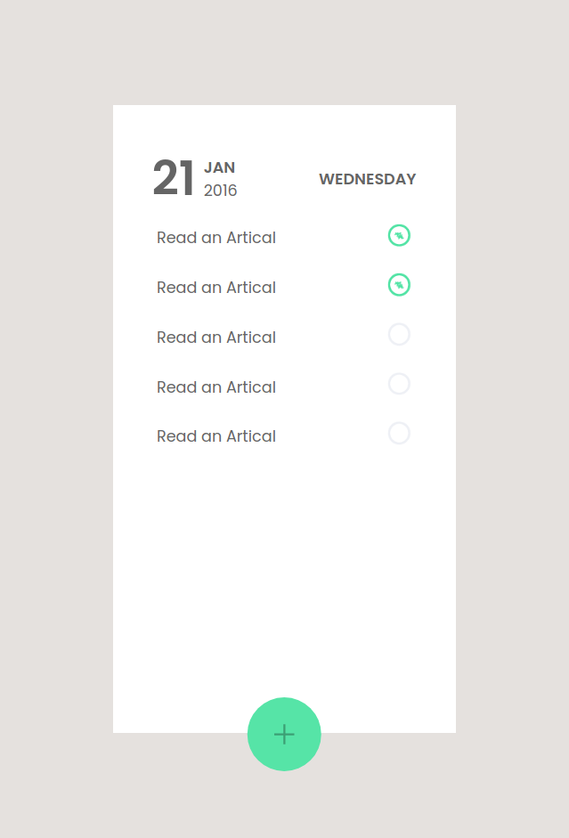

# To-do-List-App

Here in this project I have made To-do list application in React - UI and component structure

- Live Link: https://strong-granita-086ba8.netlify.app/

## In this Project 

- I have used Functional Components, Class Components and Stateless Component

- I have used [React Icon](https://react-icons.github.io/react-icons) for Icons

## How to use

- install node module ``npm install``
- run command ``npm run dev``
- now go to [http://localhost:5173/](http://localhost:5173/)

## SnapShot

